# personal-llm

**Live demo:** [llm.riera.co.uk](https://llm.riera.co.uk)

Production-oriented scaffolding for a personal domain-specialized LLM focused on professional and technical knowledge. The repository is optimized for a MacBook Pro M4 with 48 GB RAM, with an easy-first local path using `FastAPI + MLX + Chroma` and an optional upgrade path to `Qdrant + Ollama` or `llama.cpp`.

## What this repository does

- Ingests personal knowledge from Google Drive, NFS-mounted shares, local files, email archives (`mbox` or `.eml`), Linkwarden, spreadsheets, PDFs, Markdown, code repositories, and operational documentation.
- Separates raw source material from curated personal knowledge in `knowledge/` so your own opinions, defaults, and working methods become explicit training inputs.
- Normalizes and tags source data into reproducible manifests for RAG and LoRA fine-tuning.
- Enforces strict topic restriction toward professional domains such as infrastructure, DevOps, cloud, finance, tax, software, governance, and AI systems.
- Refuses and redirects off-topic requests about sports, entertainment, movies, celebrity culture, trivia, gaming, and pop culture.
- Supports local LoRA fine-tuning on Apple Silicon with MLX and remote LoRA fine-tuning on RunPod using Axolotl/PEFT.
- Serves the model through an OpenAI-compatible API with retrieval, citations, topic filtering, and configurable backend adapters.

## Default architecture

```mermaid
flowchart LR
    subgraph Sources["Personal Knowledge Sources"]
        GD["Google Drive / NFS Share"]
        EM["Email / mbox / eml / IMAP"]
        LW["Linkwarden"]
        FS["Markdown / PDFs / Docs / Sheets"]
        CR["Code Repositories"]
    end

    Sources --> ING["Ingestion + Extraction"]
    ING --> CLASS["Dedup + Domain Classification"]
    CLASS --> DATA["Processed JSONL + Parquet"]
    DATA --> RAG["Embeddings + Vector DB"]
    DATA --> SFT["LoRA Training Dataset"]
    RAG --> API["FastAPI Orchestrator"]
    SFT --> ADP["MLX / Axolotl LoRA Adapters"]
    ADP --> API
    API --> USER["CLI / Agents / OpenAI-Compatible Clients"]
```



See [architecture/overview.md](architecture/overview.md) for the full architecture narrative and rendered diagrams.

## Simplest starting path

If you want the least complicated way to build your first version of the system, start with:

- documents on a local folder or an NFS-mounted share
- emails exported as `mbox` or a folder of `.eml` files
- `MLX` for local model execution on your Mac
- `Chroma` for the first vector index
- `FastAPI` as the local API layer

You do not need Google Drive, IMAP, Ollama, Qdrant, or RunPod for the first successful local build. Those are optional integrations or upgrades.

If the tool names are unfamiliar, read [docs/00_stack_primer.md](docs/00_stack_primer.md) before the installation guide.

## First-timer defaults

This repository now uses two defaults intended to reduce configuration mistakes:

- reproducibility is snapshot-based: local and NFS sources are copied into `data/raw/` as content-addressed snapshots before extraction
- model serving is profile-driven by default: choose a model profile first, and let the profile pick the backend unless you explicitly override it for advanced use

Those defaults are the safest starting point if you are building your first personal LLM stack.

For guardrails, start with:

- `PERSONAL_LLM_GUARDRAIL_PROFILE=standard`
- the unmodified base model profile you want to use
- no adapter merge until you are happy with the runtime behavior

After that, move to `strict`, `relaxed`, or `original_model` as needed.

## Quickstart

1. Install `uv`, `ollama` (optional), and Xcode command line tools.
2. Create a virtual environment and install dependencies:

   ```bash
   uv sync --extra local --extra dev
   ```

3. Copy the environment template and edit secrets:

   ```bash
   cp .env.example .env
   ```

4. Review the default configs in [config/models.yaml](config/models.yaml) and [config/domain_taxonomy.yaml](config/domain_taxonomy.yaml).
5. Fill in your curated knowledge layer before generating training data:

   - [knowledge/persona.md](knowledge/persona.md)
   - [knowledge/domains/README.md](knowledge/domains/README.md)
   - [docs/11_personal_knowledge.md](docs/11_personal_knowledge.md)
6. Run the example ingestion pipeline:

   ```bash
   uv run personal-llm ingest --config config/sources.yaml
   uv run personal-llm extract
   uv run personal-llm classify-domains
   uv run personal-llm embed
   ```

7. Start the local API:

   ```bash
   uv run personal-llm serve --reload
   ```

8. Run the evaluation suite:

   ```bash
   uv run personal-llm evaluate
   ```

Detailed walkthroughs live in [docs/01_installation.md](docs/01_installation.md) through [docs/18_improvement_and_degradation.md](docs/18_improvement_and_degradation.md). Guardrail tuning is covered in [docs/09_guardrails.md](docs/09_guardrails.md), dataset design in [docs/10_dataset_design_examples.md](docs/10_dataset_design_examples.md), curated knowledge authoring in [docs/11_personal_knowledge.md](docs/11_personal_knowledge.md), data quality in [docs/13_data_quality.md](docs/13_data_quality.md), the first real adapter workflow in [docs/15_first_training_run.md](docs/15_first_training_run.md), repeated guardrail-profile benchmarking in [docs/16_guardrail_matrix.md](docs/16_guardrail_matrix.md), beginner-friendly metric reading in [docs/17_reading_evaluation_results.md](docs/17_reading_evaluation_results.md), and change-assessment guidance in [docs/18_improvement_and_degradation.md](docs/18_improvement_and_degradation.md).

## Documentation site

This repository now includes a GitHub Pages-friendly documentation site based on MkDocs.

Preview it locally:

```bash
uv sync --extra docs
uv run mkdocs serve
```

Build the published site locally:

```bash
uv run mkdocs build
```

Publishing details are in [docs/19_github_pages.md](docs/19_github_pages.md).

## Base model recommendations

| Model | Default usage | Strengths | Tradeoffs |
| --- | --- | --- | --- |
| `Qwen2.5-3B-Instruct` | Fast end-to-end dry run | Smallest practical real-model path in this repo, same family as the default, good for validating ingestion, prompts, evaluation, and LoRA workflow quickly | Lower answer quality and less headroom than 7B models |
| `Qwen2.5-7B-Instruct` | Primary default | Strong reasoning, efficient local quantization, good coding and technical summarization | Slightly smaller ecosystem than Llama |
| `Qwen2.5-14B-Instruct` | Higher-quality local/remote option | Better depth on multi-step reasoning and synthesis | Heavier memory footprint, slower iteration |
| `Llama 3.1 8B Instruct` | Compatibility option | Broad community tooling and proven adapters | Less compelling default quality than Qwen2.5 for this use case |
| `Mistral 7B Instruct` | Lightweight fallback | Fast inference, efficient quantization | Narrower context quality on complex enterprise synthesis |
| `Phi-3 Medium / Mini` | Edge fallback | Small footprint and good latency | Less headroom for broad professional domain synthesis |

## Repository map

| Path | Purpose |
| --- | --- |
| `docs/` | Step-by-step guides, operational runbooks, and maintenance procedures |
| `site-docs/` | GitHub Pages build root made of symlinks back to the canonical documentation files |
| `architecture/` | Mermaid diagrams and architecture narratives for ingestion, training, serving, and security |
| `knowledge/` | Curated personal knowledge, persona, domain opinions, and versioned knowledge snapshots |
| `data/raw/` | Immutable source drops and downloaded originals |
| `data/processed/` | Normalized documents, chunk manifests, and embedding-ready corpora |
| `data/training/` | SFT, refusal, and evaluation datasets plus dataset manifests |
| `pipelines/` | Top-level notes for ETL stages and reproducibility expectations |
| `scripts/` | Bootstrap, sync, reindex, retrain, backup, and remote-training helper scripts |
| `rag/` | RAG-specific notes and vector-store setup references |
| `vector-db/` | Collection schemas, Docker Compose, and adapter notes for Chroma and Qdrant |
| `models/` | Model backend notes, quantization guidance, and model selection references |
| `adapters/` | LoRA outputs, config templates, and export helpers |
| `prompts/` | System prompts, refusals, routing prompts, and policy assets |
| `evaluation/` | Benchmark definitions, reports, and scoring outputs |
| `connectors/` | Connector-specific operational docs and source-format notes |
| `deployment/` | Local API manifests, `launchd/` templates, Ollama assets, and serving configuration |
| `tests/` | Unit, integration, smoke tests, and fixture corpora |
| `config/` | YAML configuration for models, sources, training, evaluation, security, and topic taxonomy |
| `src/personal_llm/` | Python package implementing CLIs, connectors, ETL, RAG, serving, and evaluation |

## Professional-domain scope

The assistant is intentionally specialized for:

- IT infrastructure, DevOps, cloud, distributed systems, platform engineering, IAM, automation engineering, AI orchestration, software engineering, self-hosting, homelabs
- Finance, accounting, tax law and corporate taxation, financial modeling, startup and SaaS building, investment analysis, energy optimization, productivity systems, governance, cybersecurity, data engineering

The assistant must refuse or redirect:

- Sports
- Entertainment
- Television
- Movies
- Celebrity culture
- Historical storytelling
- Trivia
- Gaming
- Pop culture

Enforcement is layered through taxonomy filters, curated datasets, retrieval filtering, system prompts, refusal fine-tuning examples, and runtime policy validation.

## Local versus remote workflows

- Local default: Apple Silicon MLX inference and LoRA adapters, Chroma vector search, FastAPI orchestration.
- Fast local dry run: `qwen2.5-3b-instruct` with the same prompts, evaluation suite, and API flow you will use later for the 7B profile.
- Optional local upgrade: Qdrant + Ollama with the same API contracts and chunk metadata schema.
- Optional remote LoRA: RunPod automation is included in `scripts/train_remote_runpod.py` and [docs/06_external_training.md](docs/06_external_training.md). Lambda Labs, Modal, Together AI, Replicate, Hugging Face, and Vast.ai are documented with reusable templates.

## Security defaults

- Assume the repository is private and source documents are sensitive by default.
- Store secrets in `.env` or a `sops + age` encrypted overlay.
- Keep `data/raw/` encrypted at rest with FileVault and encrypted backups.
- Do not send proprietary documents to remote GPUs unless the dataset was explicitly filtered and approved for export.

## Next steps

- Start with [docs/01_installation.md](docs/01_installation.md).
- Write your response style and domain opinions in [knowledge/persona.md](knowledge/persona.md) and the files listed in [knowledge/domains/README.md](knowledge/domains/README.md).
- Configure sources in [config/sources.yaml](config/sources.yaml).
- Review training defaults in [config/training.yaml](config/training.yaml).
- Use [docs/14_workflow_map.md](docs/14_workflow_map.md) if you want a decision-tree for common tasks.
- Follow [docs/15_first_training_run.md](docs/15_first_training_run.md) before your first serious LoRA job.
- Run the sample smoke tests in [tests/smoke/README.md](tests/smoke/README.md).
