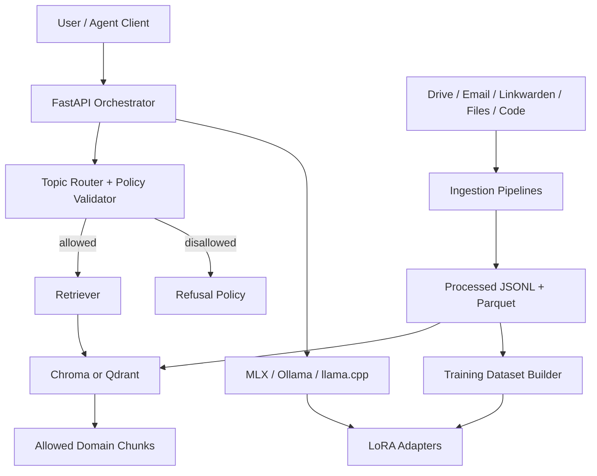
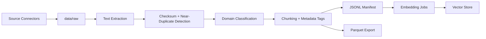
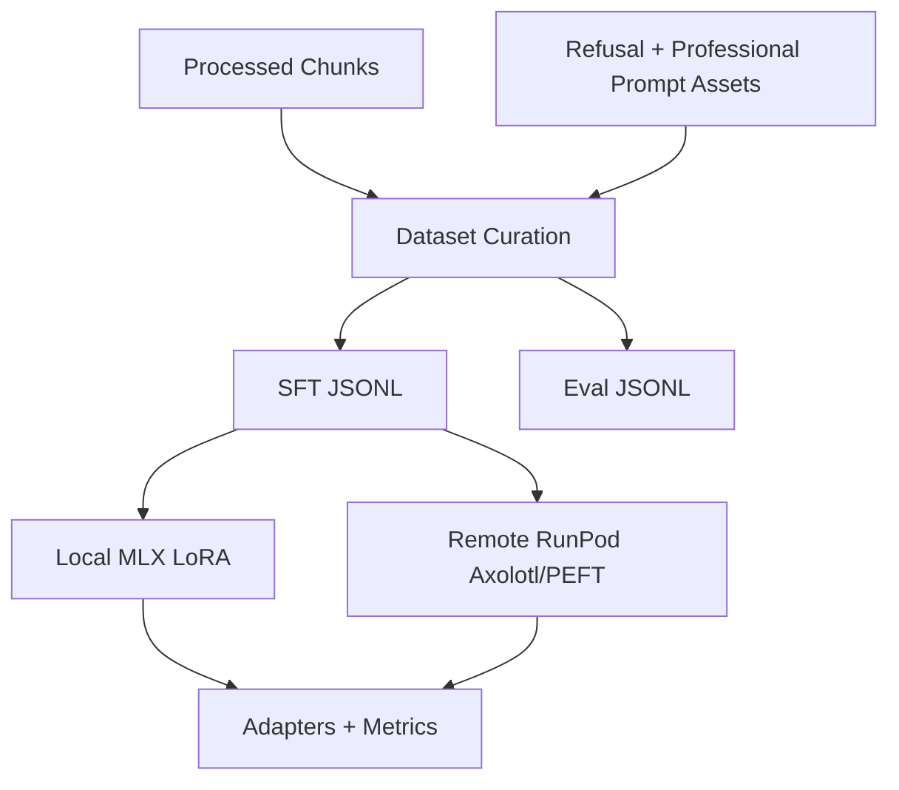
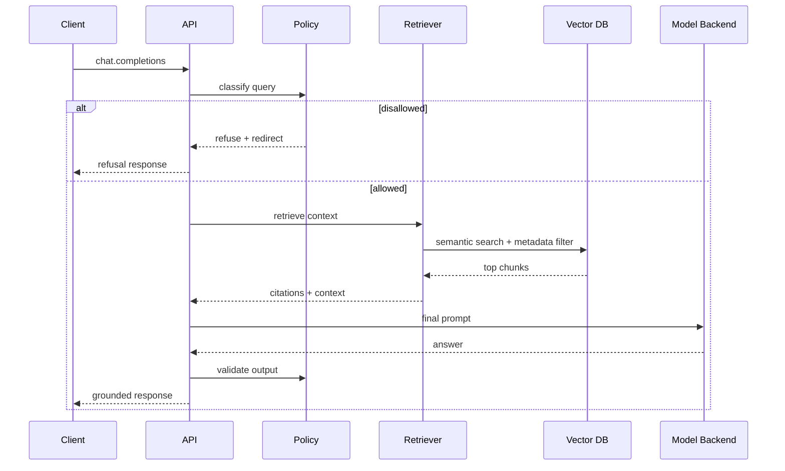
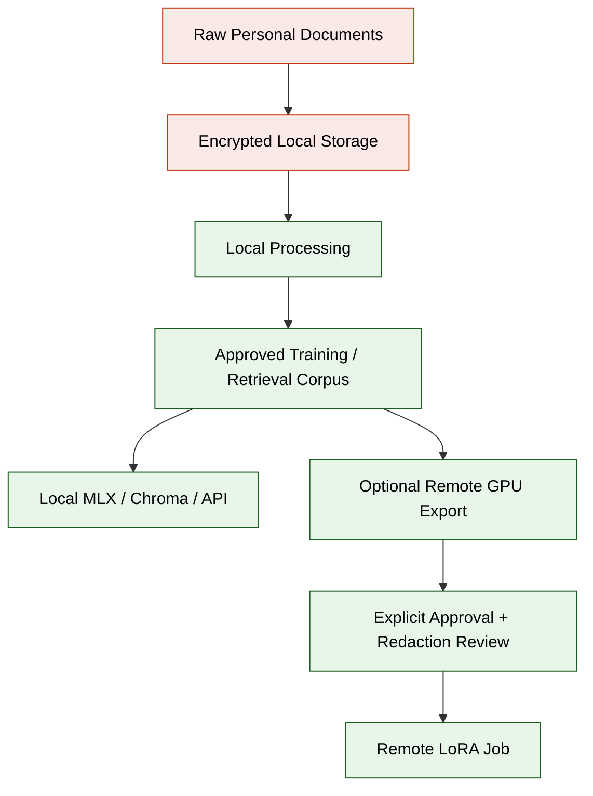

# Architecture Overview

## Design principles

- Keep the first-run experience simple on Apple Silicon.
- Preserve stable interfaces so the local quickstart can evolve into a more production-style deployment.
- Keep training adapter-based and retrieval-grounded.
- Bias the system strongly toward professional domains through multiple independent control layers.
- Keep raw data private and minimize unnecessary export to external compute.

## Diagrams

- [system-overview.mmd](system-overview.mmd)
- [ingestion-flow.mmd](ingestion-flow.mmd)
- [training-flow.mmd](training-flow.mmd)
- [serving-sequence.mmd](serving-sequence.mmd)
- [security-boundaries.mmd](security-boundaries.mmd)

## System overview

## Ingestion flow

## Training flow

## Serving sequence

## Security boundaries

## Components

- Connectors acquire or scan sources and write immutable raw artifacts plus normalized source manifests.
- Pipelines extract text, deduplicate, chunk, and classify domains before exporting processed corpora.
- Training builds SFT and refusal datasets for MLX or remote Axolotl/PEFT jobs.
- RAG indexes allowed-domain chunks and filters disallowed or sensitive data by policy.
- The API orchestrator classifies every query before retrieval or generation.
