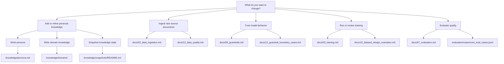

# 14 Workflow Map

Use this page when you know what you want to do but not which document to open first.

## I want to...

| Goal | Start here | Then go here |
| --- | --- | --- |
| Add my own opinions and defaults | [docs/11_personal_knowledge.md](11_personal_knowledge.md) | [knowledge/persona.md](../knowledge/persona.md) |
| Ingest local, NFS, email, or Linkwarden data | [docs/02_data_ingestion.md](02_data_ingestion.md) | [docs/13_data_quality.md](13_data_quality.md) |
| Build better SFT examples | [docs/10_dataset_design_examples.md](10_dataset_design_examples.md) | [data/training/examples/README.md](../data/training/examples/README.md) |
| Make the model more or less restrictive | [docs/09_guardrails.md](09_guardrails.md) | [docs/12_guardrail_boundary_cases.md](12_guardrail_boundary_cases.md) |
| Compare guarded versus original-model behavior | [docs/09_guardrails.md](09_guardrails.md) | [docs/07_evaluation.md](07_evaluation.md) |
| Run a first local LoRA job | [docs/03_training.md](03_training.md) | [docs/10_dataset_design_examples.md](10_dataset_design_examples.md) |
| Review whether the model is actually good | [docs/07_evaluation.md](07_evaluation.md) | [evaluation/cases/README.md](../evaluation/cases/README.md) |

## Recommended first-timer path

1. read [docs/00_stack_primer.md](00_stack_primer.md)
2. complete [docs/01_installation.md](01_installation.md)
3. write [knowledge/persona.md](../knowledge/persona.md)
4. fill in two or three files listed in [knowledge/domains/README.md](../knowledge/domains/README.md)
5. ingest your first sources
6. create a small curated dataset
7. run evaluation before and after LoRA training
