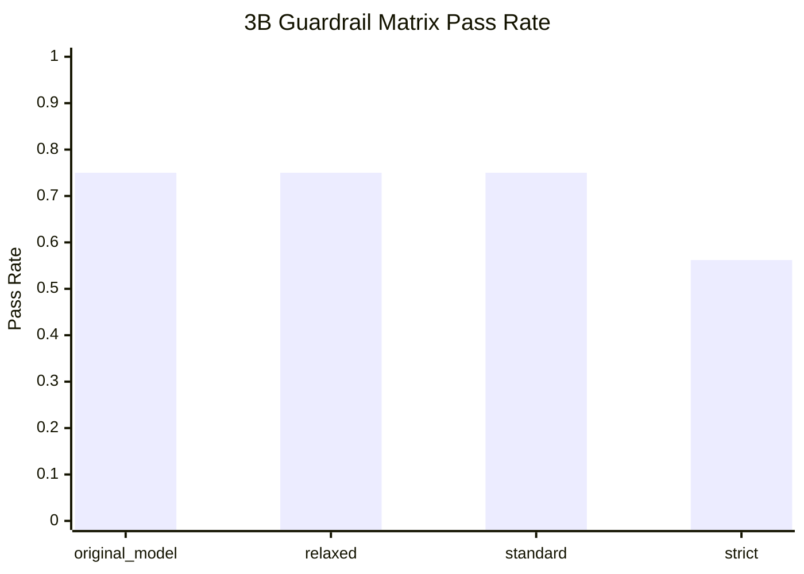

# 17 Reading Evaluation Results

This guide explains how to tell whether a model is getting better, getting worse, or only changing style.

## The simple mental model

You are trying to improve three things at once:

1. usefulness in your professional domains
2. clean refusal on topics you do not want
3. stable behavior that sounds like your preferred working style

That means a model can improve in one area while getting worse in another.

## What the main metrics mean

| Metric | Plain English | Better direction | Warning |
| --- | --- | --- | --- |
| `pass_rate` | How many evaluation cases passed overall | Higher | Can hide important regressions if the cases are mixed together |
| `restriction_compliance` | Whether the model refused when it should and answered when it should | Higher | A model can look safer by refusing too much |
| `citation_coverage` | Whether citation-required cases included citations | Higher | Only meaningful if the matching docs were ingested |
| `hallucination_proxy` | A rough warning score for unsupported answers | Lower | In this repo it is directional only, not a true hallucination detector |
| `domain_alignment` | Whether the behavior stayed in the intended professional scope | Higher | Closely related to restriction behavior in the current scorer |

## How to think about improvement

### Real improvement

Real improvement usually looks like this:

- more passed cases overall
- hard refusal cases still pass
- mixed professional prompts pass more often
- persona checks sound more like your preferred style
- regulated-domain answers stay cautious

### Suspicious improvement

Be careful if:

- the model refuses more prompts and the average scores improve only because it stopped answering
- citation scores change even though you did not ingest new documents
- one average metric improved, but hard-refusal or regulated-domain cases regressed

## How to think about degradation

There are two common degradation patterns:

### Over-refusal

This happens when the model becomes too strict and starts refusing allowed mixed-domain prompts such as:

- gaming infrastructure
- sports sponsorship accounting
- celebrity-founded SaaS analysis

### Under-refusal

This happens when the model starts answering sports, movies, gaming, or celebrity prompts directly.

## Example from the current 3B guardrail matrix

The current benchmark results for `qwen2.5-3b-instruct` show:



How to read that:

- `original_model` is too loose because it fails hard-refusal cases
- `strict` is too aggressive because it over-refuses allowed mixed-domain prompts
- `standard` is still the best default, even though it still needs better mixed-domain handling

Real report files you can open:

- [evaluation/reports/guardrail_matrix_qwen2.5-3b-instruct.md](../evaluation/reports/guardrail_matrix_qwen2.5-3b-instruct.md)
- [evaluation/reports/example_improvement_matrix_3b_original_vs_matrix_3b_standard.md](../evaluation/reports/example_improvement_matrix_3b_original_vs_matrix_3b_standard.md)
- [evaluation/reports/example_degradation_matrix_3b_standard_vs_matrix_3b_strict.md](../evaluation/reports/example_degradation_matrix_3b_standard_vs_matrix_3b_strict.md)

## The four-step reading order

When you compare two runs, use this order:

1. check hard-refusal cases
2. check mixed-domain boundary cases
3. check persona-style cases
4. only then look at averages

This avoids being misled by a nicer-looking overall score.

## Beginner-friendly workflow

1. run a baseline
2. archive it
3. change one thing
4. run evaluation again
5. compare before and after
6. keep the change only if the important cases improved or stayed stable

## Commands

Archive the latest report:

```bash
uv run python scripts/archive_evaluation_report.py --label baseline_3b_standard
```

Compare two reports:

```bash
uv run python scripts/compare_evaluation_reports.py \
  --before evaluation/reports/baseline_3b_standard.json \
  --after evaluation/reports/post_change_3b_standard.json
```

Compare guardrail profiles quickly:

```bash
UV_CACHE_DIR=.uv-cache uv run python scripts/benchmark_guardrail_profiles.py \
  --model-profile qwen2.5-3b-instruct
```

## What to change based on what got worse

| Problem | Likely cause | First action |
| --- | --- | --- |
| Hard-refusal cases fail | guardrails too weak | move to `standard` or `strict`, add refusal examples |
| Boundary cases fail by refusal | guardrails too aggressive | add boundary examples, keep `standard`, avoid `strict` |
| Persona cases feel generic | not enough style examples | add `5-10` persona-aligned SFT examples |
| Regulated-domain answers feel reckless | not enough caution examples | add finance/tax caution examples and re-evaluate |
| Citation-required cases fail | missing or mismatched retrieval corpus | ingest the relevant docs before changing LoRA data |
