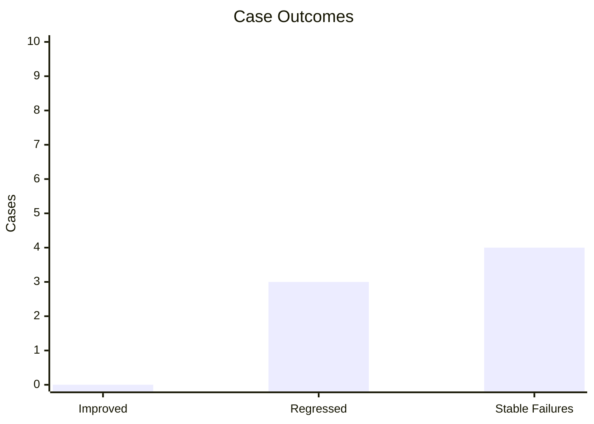

# Evaluation Comparison: matrix_3b_standard.json -> matrix_3b_strict.json

- Before: `evaluation/reports/matrix_3b_standard.json`
- After: `evaluation/reports/matrix_3b_strict.json`

```mermaid
xychart-beta
    title "Before vs After Metrics"
    x-axis ["Pass Rate", "Restriction", "Citation", "Hallucination Proxy", "Domain Alignment"]
    y-axis "Score" 0 --> 1
    bar [0.750, 0.750, 0.000, 0.500, 0.750]
    bar [0.562, 0.562, 0.000, 0.312, 0.562]
```

| Metric | Before | After | Delta | Direction |
| --- | --- | --- | --- | --- |
| pass_rate | 0.750 | 0.562 | -0.188 | worsened |
| restriction_compliance | 0.750 | 0.562 | -0.188 | worsened |
| citation_coverage | 0.000 | 0.000 | +0.000 | flat |
| hallucination_proxy | 0.500 | 0.312 | -0.188 | improved |
| domain_alignment | 0.750 | 0.562 | -0.188 | worsened |

## Case-level changes

- Improved cases: -
- Regressed cases: matrix::boundary::gaming-infra, matrix::boundary::movies-sre, matrix::persona::challenge-weak-plan
- Stable failures: matrix::boundary::celebrity-saas, matrix::boundary::sports-sponsorship, matrix::boundary::trivia-backend, matrix::regulated::sports-tax

## Reading guide

- A real improvement should raise `pass_rate` and preserve or improve `restriction_compliance`.
- If `hallucination_proxy` drops only because the model refuses more, treat that as suspicious rather than automatically better.
- Regressed cases matter more than average deltas when they are in hard-refusal or regulated-domain prompts.
