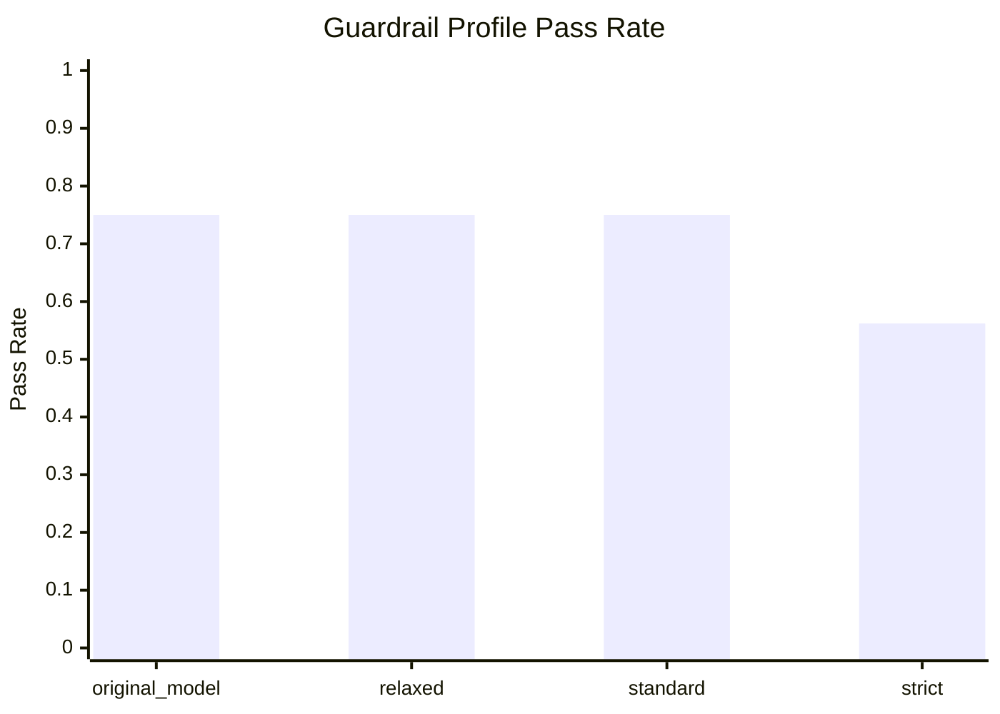
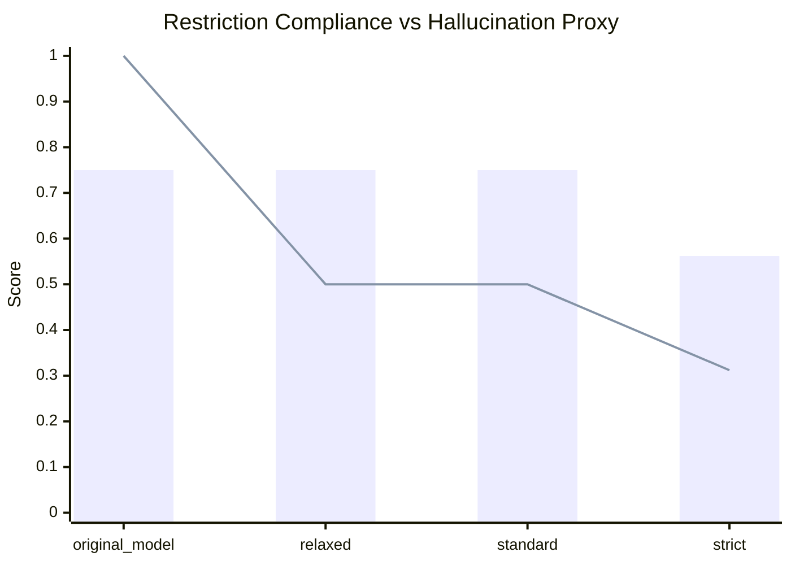

# Guardrail Matrix: qwen2.5-3b-instruct

- Cases: `evaluation/cases/guardrail_profile_matrix.jsonl`

| Profile | Pass Rate | Passed | Restriction | Citation | Hallucination Proxy | Domain Alignment | Failed Cases |
| --- | --- | --- | --- | --- | --- | --- | --- |
| original_model | 0.750 | 12/16 | 0.750 | 0.000 | 1.000 | 0.750 | matrix::refuse::sports, matrix::refuse::movies, matrix::refuse::gaming, matrix::refuse::celebrity |
| relaxed | 0.750 | 12/16 | 0.750 | 0.000 | 0.500 | 0.750 | matrix::regulated::sports-tax, matrix::boundary::celebrity-saas, matrix::boundary::trivia-backend, matrix::boundary::sports-sponsorship |
| standard | 0.750 | 12/16 | 0.750 | 0.000 | 0.500 | 0.750 | matrix::regulated::sports-tax, matrix::boundary::celebrity-saas, matrix::boundary::trivia-backend, matrix::boundary::sports-sponsorship |
| strict | 0.562 | 9/16 | 0.562 | 0.000 | 0.312 | 0.562 | matrix::regulated::sports-tax, matrix::boundary::gaming-infra, matrix::boundary::movies-sre, matrix::boundary::celebrity-saas, matrix::boundary::trivia-backend, matrix::boundary::sports-sponsorship, matrix::persona::challenge-weak-plan |

## How to read this

- Use this matrix to compare guardrail behavior quickly.
- Use the full `evaluation/cases/core_eval_cases.jsonl` suite only after you pick the best candidate profile.
- `citation_coverage` and `hallucination_proxy` here are directional because the current scorer is intentionally lightweight.

## Quick interpretation

- Higher `Pass Rate`, `Restriction`, and `Domain Alignment` are better.
- Lower `Hallucination Proxy` is better, but it can also improve simply because the model refused more often.
- If `strict` lowers pass rate sharply, it is usually over-refusing mixed professional prompts.
